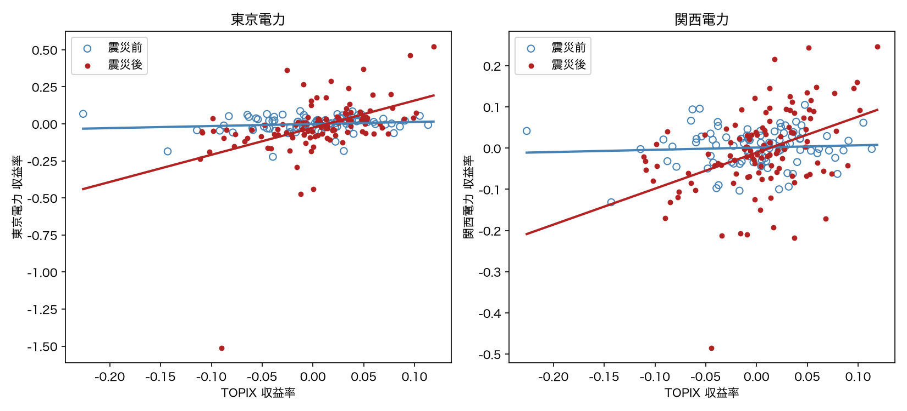

# 東日本大震災前後の電力株の構造変化分析

東日本大震災（2011年3月11日）を境に、東京電力・関西電力の株価と株式市場全体（TOPIX）との関係が変わったかを、
月次収益率のマーケットモデルとダミー変数で検証した分析です。R と Python の両方で実装し、数値が一致することをテストで確認しています。

**結論**：両社とも市場感応度（ベータ）が震災後に有意に上昇しました。

| | 震災前 β | 震災後 β | 構造変化の検定（Chow） |
|---|---|---|---|
| 東京電力 | 0.14（有意でない） | **1.83** | F(2,201)=10.40, p=0.00005 |
| 関西電力 | 0.05（有意でない） | **0.87** | F(2,201)=8.03, p=0.00044 |



規制に守られて市場とほぼ連動しなかった電力株が、震災を境に通常の株式に近い性質を持つようになった、と解釈できます。
直接被災していない関西電力にも同じ変化が出ている点から、東京電力固有の事故ではなく電力業界全体の変化と考えられます。
詳しい結果・頑健性の確認・限界は **[report/report.pdf](report/report.pdf)** にまとめています。

## 手法の要点

- 株価を対数収益率 `diff(log(price))` に変換（n = 205、2003年10月〜2020年10月）
- 震災後を 1 とするダミー `d` と交差項 `d·x`（x は TOPIX 収益率）を入れた回帰
  `y = α + γd + βx + δ(d·x) + u` で、切片の変化（γ）と傾きの変化（δ）を分離
- γ = δ = 0 の同時検定（Chow 検定）で構造変化の有無を判定
- 修正済み決定係数（平均まわりで統一）でモデルを比較
- 頑健性：White / Newey-West 標準誤差、2011年3月の除外、断点の移動、分散比の検定

## 再現方法

リポジトリのルートを作業ディレクトリにして実行します。

**R**（追加パッケージ不要。`MASS` は R 標準同梱）

```r
source("code/01_market_model_analysis.R")
```

**Python**（3.13 で確認）

```bash
python -m venv .venv && source .venv/bin/activate
pip install -r requirements.txt
python code/01_market_model_analysis.py      # 図を output/ に保存
```

**テスト**（Python の結果が R の出力と一致することを確認）

```bash
pip install -r requirements-dev.txt
pytest
```

## 構成

```
.
├── code/        分析コード（R版・Python版）
├── data/        月次データ（出典と列の説明は data/README.md）
├── output/      生成した図
├── report/      分析レポート（report.pdf と、その HTML ソース）
├── tests/       R と Python の数値一致テスト
├── docs/        Python 移植の要件定義
└── requirements*.txt / R-packages.txt
```

## 限界

- 相関の分析であり、震災が原因だと厳密に証明したものではありません（同時期の欧州債務危機・政権交代等の影響を分離していません）。
- 震災後は誤差分散が大きく変化しており（東京電力で約13.5倍）、通常の標準誤差は前提が崩れます。頑健標準誤差でも結論が変わらないことは確認しています。
- 対象は2社のみです。他の電力会社や、原発を持たない公益企業との比較は未実施です。
- 株価には配当が含まれず、無リスク金利も引いていないため、厳密な CAPM の超過収益ではありません。

## ライセンス

コードは [MIT License](LICENSE)。データの権利は各権利者に帰属します（[data/README.md](data/README.md)）。
